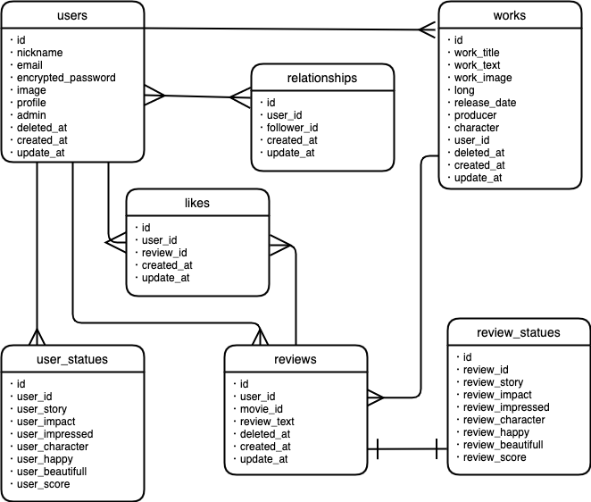

# アプリケーション名
## Sympasee
---
# アプリケーションの概要
映像作品をレビューし共有できるWebアプリケーションを作成しました。ユーザーは好きな映像作品を作品一覧、検索、ランキングから探してレビューできます。レビューするごとに自分の注目度スターテスが更新されていき、気の合う他のユーザーを見つけフォローなど行うことができます。どの映像作品を見るか迷った際は気の合うユーザーのレビューを参考にすることで良い映像作品と出会いやすくなります。

# URL
<http://54.95.42.129/>

# テスト用アカウント

ユーザー
メールアドレス: aaa@aaa
パスワード: aaa111

管理者
メールアドレス名: admin@admin
パスワード: adminadmin

# 利用方法
### 注意書き
※WebブラウザGoogle Chromeの最新版を利用してアクセスしてください。
ただしデプロイ等で接続できないタイミングもございます。その際は少し時間をおいてから接続してください。
接続先およびログイン情報については、上記の通りです。
同時に複数の方がログインしている場合に、ログインできない可能性があります。

### 利用方法
①テストアカウントでログイン→トップページ、またはランキングからレビューしたい作品を選ぶ→②作品詳細ページからレビューを入力を選ぶ→③レビューと感想を入力し確定ボタンを押す。④詳細ページ遷移後下にスクロールすると自分のレビューが投稿されていることが確認できる。⑤また、他の人のレビューを確認できユーザー名を押すことでそのレビューしたユーザーの注目度を確認できる。そこでフォローすることもできる。⑥フォローをするとヘッダーのフォローリストから遷移できるページにフォローしたユーザーが追加される。

確認後、ログアウト処理をお願いします。

# 目指した課題解決
普段アニメをよく見て、より面白い作品を探す方法はないかとレビューサイトを見たりしますが、総合評価と私個人の評価がマッチしないことが多い、また、レビューサイトごとに評価が全然違って当てにならないと感じておりました。 それであったら評価をジャンルごと、そしてどのような人が評価をつけたのかがわかるサイトにしてしまえば、根拠を持って良い作品を探せるのではないかと考え、本Webアプリケーションを作成いたしました。

# 洗い出した要件
| 機能：     トップページ（映像作品一覧ページ）  
| -------------
|【表示】
|管理者が登録した映像作品の一覧を見ることができる。
|管理者が登録したピックアップ作品を見ることができる。
|【ボタン】
|サインアップ/ログインページへ遷移できるボタンがある。
|ログイン時は、ログアウトできるボタンがある。
|フォロワーリストへ遷移するボタンがある。
|フォローリストへ遷移するボタンがある。
|ランキングへ遷移するボタンがある。
|管理者のみ作品を追加するページへ遷移できるボタンがある。
|ログイン時にマイページに遷移できるボタンがある
|作品一覧から詳細ページへ遷移するボタンがある。
|ページネーションのボタンがある。

| 機能：     タグ
| -------------
|【表示】
|トップページで作品ごとにジャンルなどが書かれているタグを見ることができる。
|作品詳細ページで作品ごとにジャンルなどが書かれているタグを見ることができる。
|【機能詳細】
|タグをクリックすることで同じタグの作品がトップページに表示される。
|検索ワードにタグの文字列が入っていると検索にヒットする。

| 機能：     検索  
| -------------
|【表示】
|トップページに検索のフォームが表示されている。
|【機能詳細】
|タイトルの文字列をあいまい検索する。
|タグを完全一致検索する。

| 機能：     ランキング  
| -------------
|【表示】
|ストーリー、衝撃、感動などのジャンルごとにそれぞれランキングが1位から3位まで表示されている。
|【ボタン】
|作品をクリックすると詳細ページに遷移する。

| 機能：     映像作品詳細ページ  
| -------------
|【表示】
|映像作品の詳細を見ることができる
|映像作品のストーリー、衝撃、感動などのジャンルごとにそれぞれレビューの平均値を見ることができる。
|ユーザーごとのレビューを見ることができる。
|【ボタン】
|レビューを入力するページに遷移するボタンがある。
|管理者とレビューの投稿者のみ投稿したレビューを削除するボタンがある。
|レビューしたユーザーのユーザーページへ遷移できるボタンがある。
|管理者のみ作品情報編集ページへ遷移するボタンがある。
|管理者のみ作品を削除するボタンがある。（論理削除）

| 機能：     作品レビューページ  
| -------------
|【表示】
|作品の点数や感想を入力する欄がある。
|【機能詳細】
|ここで入力された値は作品の評価の平均値へ影響し、また、ユーザーの注目度スターテスにも影響する。

| 機能：     ユーザー詳細ページ  
| -------------
|【表示】
|ユーザーのプロフィール画像と自己紹介文を見ることができる。
|ユーザーが映像作品の何に注目しているかグラフで知ることができる。
|【ボタン】
|フォローまたはフォロー解除ボタンがある。

| 機能：     フォローリスト  
| -------------
|【表示】
|ユーザーがフォローしたユーザーの一覧を見ることができる。

| 機能：     フォロワーリスト  
| -------------
|【表示】
|他のユーザーがフォローされた場合、フォロワーの一覧を見ることができる。

| 機能：     映像作品追加ページ（管理者のみ）  
| -------------
|【表示】
|映像作品の情報の入力欄がある
|【ボタン】
|入力情報を確定するボタンがある

| 機能：     映像作品編集ページ（管理者のみ）  
| -------------
|【表示】
|映像作品の情報の編集する欄がある
|【ボタン】
|編集情報を確定するボタンがある

# 実装内容
洗い出した課題の中から、タグ機能、レーティング機能、フォローフォロワー機能について追加実装を行いました。それぞれの仕様を紹介します。

## タグ機能
こちらのURL（<http://54.95.42.129/>） にアクセスし
メールアドレス: aaa@aaa
パスワード: aaa111
にてログインするとご覧いただけます。

タグをクリックすることで、同じタグの作品を検索することができます。また、検索枠からの検索においてもタグを検索することができます。
この機能により、自分の気になっている、探している作品にたどり着きやすくなります。

## レーティング機能
ログインした状態で、こちらのURL（<http://54.95.42.129/movies/1/reviews/new>） にアクセスするとご覧いただけます。

総合評価では参考にならないと考え、ストーリー、衝撃、感動、楽しさ、登場人物、映像美の６つのジャンルごとに評価できるようにしております。
レビュー時の⭐️はマウスクリックで確定し、何回でもクリックし直すことで非同期で訂正できます。

## ユーザーパラメーター機能
ユーザー詳細表示ページ（<http://54.95.42.129/users/8>） から確認することができます。

ユーザーはレビューするごとに裏パラメーターとして、ジャンルごとの注目度が設定されます。これによりユーザーのレビューの傾向を知ることで気の合うユーザーの評価を見つけることができます。また、気の合わないユーザーの意見というのも把握することができます。

## フォローフォロワー機能
ログインした状態であるとユーザーパラメーター機能と同じように、ユーザー詳細表示ページ（<http://54.95.42.129/users/8>） から確認することができます。

「フォロー」をクリックすると、ユーザーを非同期通信にてフォローすることができます。フォローしたユーザーは、自身のフォローリストから確認することができます。

この機能によって「自身と気の合うユーザーにすぐにアクセスできる」という利点があります。

# 実装予定の機能
| 機能       | 目的                       | 詳細                                   |	ストーリー(ユースケース)                             |
| --------- | ---------------------------| ------------------------------------- | ------------------------------------------------- |
| いいね機能 | レビューがいいねされることにより、レビューの質が上がりやすくなる。 | 映像作品のレビュー一覧にいいねボタンをつける。| ユーザーが映像作品のレビューに対して参考になったと思ったり、素晴らしい感想だと感じたらいいねボタンを押す。いいねを取り消したい場合はもう一度いいねボタンを押す。|

# データベース設計

# 開発状況
### 開発環境
Ruby 2.6.5/Ruby on Rails 6.0.3.6/MySQL/Github/AWS/Visual Studio Code
### 開発期間と平均作業時間
開発期間：4/14〜5/14（30日間）
1日あたりの平均作業時間：7
合計：210時間
